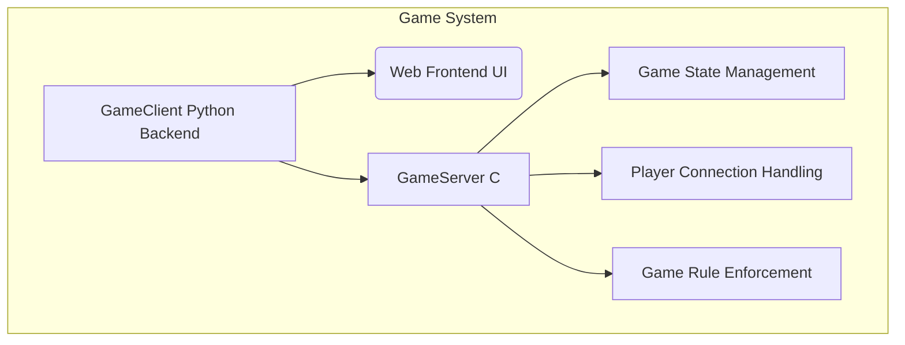

# Project Plan: Exploding Kittens

## 1. Project Overview

The Exploding Kittens project will consist of a C-based `GameServer` responsible for managing game state and logic, and a Python-based `GameClient` that provides a web-based user interface for players to interact with the game.

## 2. Architectural Diagram

<!-- style A fill:#f9f,stroke:#333,stroke-width:2px -->
<!-- style B fill:#bbf,stroke:#333,stroke-width:2px -->
<!-- style C fill:#f9f,stroke:#333,stroke-width:2px -->
<!-- style D fill:#ccf,stroke:#333,stroke-width:2px -->
<!-- style E fill:#ccf,stroke:#333,stroke-width:2px -->
<!-- style F fill:#ccf,stroke:#333,stroke-width:2px -->

## 3. Component Breakdown and Development Phases

### Phase 1: GameServer (C) Development

*   **Objective**: Implement the core game logic, state management, and network communication for the server.
*   **Key Tasks**:
    *   **Data Structures**: Define C structs for `Player`, `Card`, `Deck`, `GameState`, and `Action`.
    *   **Game Logic**: Implement functions for shuffling the deck, dealing cards, handling turns, drawing cards, playing action cards, and resolving Exploding Kittens.
    *   **Network Module**: Implement TCP/IP socket programming for handling multiple player connections.
    *   **Protocol Implementation**: Define and implement the binary communication protocol for messages between the server and client (e.g., `DRAW_CARD`, `PLAY_CARD`, `UPDATE_STATE`).
    *   **Game State Management**: Ensure consistent and synchronized game state across all connected clients.
    *   **Error Handling**: Implement robust error handling for network issues, invalid player actions, and game rule violations.

### Phase 2: GameClient (Python Backend) Development

*   **Objective**: Create the Python backend to connect to the `GameServer`, manage client-side game state, and serve the web frontend.
*   **Key Tasks**:
    *   **Network Module**: Implement client-side TCP/IP socket programming to connect to the C `GameServer`.
    *   **Protocol Parsing**: Implement logic to send and receive messages using the defined binary protocol.
    *   **Client-Side Game State**: Maintain a local representation of the player's hand and relevant game state.
    *   **Web Server**: Set up a lightweight Python web server (e.g., Flask, FastAPI) to serve the frontend and handle API requests from the UI.
    *   **API Endpoints**: Create API endpoints for actions like `draw_card`, `play_card`, `get_hand`, `get_game_state`.
    *   **Frontend Integration**: Bridge communication between the web frontend (JavaScript) and the Python backend.

### Phase 3: GameClient (Web Frontend - UI) Development

*   **Objective**: Develop a simple, interactive web user interface for players.
*   **Key Tasks**:
    *   **UI Framework**: Choose a lightweight frontend framework or use vanilla HTML/CSS/JavaScript.
    *   **Card Display**: Implement UI components to display the player's hand of cards.
    *   **Action Buttons**: Create interactive elements for drawing cards and playing action cards.
    *   **Game State Display**: Show relevant game information (e.g., number of cards in deck, current player, discard pile).
    *   **Real-time Updates**: Implement mechanisms (e.g., WebSockets, long polling) to receive real-time game state updates from the Python backend.
    *   **User Feedback**: Provide visual feedback for actions taken and game events.

### Phase 4: Communication Protocol Definition

*   **Objective**: Clearly define the binary protocol for server-client communication.
*   **Key Tasks**:
    *   **Message Types**: Define distinct message types for different actions (e.g., `JOIN_GAME`, `DRAW_CARD_REQUEST`, `PLAY_CARD_REQUEST`, `GAME_STATE_UPDATE`, `PLAYER_HAND_UPDATE`).
    *   **Data Formats**: Specify the exact byte structure for each message type, including headers, payload, and any necessary identifiers.
    *   **Error Codes**: Define standard error codes for protocol-level issues.

## 4. Testing and Deployment

*   **Unit Testing**: Implement unit tests for individual functions and modules in both C and Python.
*   **Integration Testing**: Test the communication and interaction between the `GameServer` and `GameClient`.
*   **Multi-player Testing**: Simulate multiple clients connecting and playing a full game.
*   **Deployment Strategy**: Outline how to compile and run the C server and how to run the Python client (e.g., using `gunicorn` for the web server, `nginx` as a reverse proxy).

## 5. Future Enhancements (Out of Scope for Initial Plan)

*   Advanced AI opponents
*   More complex card effects
*   Persistent game states
*   User authentication and profiles
