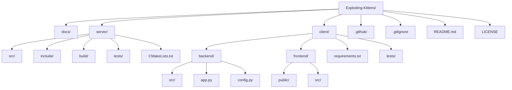

## Foundational Technical Setup Plan (Revised)

This plan outlines the initial steps for setting up the development environment, project structure, and essential tooling for the Exploding Kittens project, which comprises a C-based `GameServer` and a Python-based `GameClient` with a vanilla web frontend.

### 1. Core Directory Structure

The project will adopt a monorepo-like structure to house both the C `GameServer` and Python `GameClient`, along with shared documentation and CI/CD configurations.



**Detailed Structure:**

*   `/Exploding-Kittens/` (Root Project Directory)
    *   `docs/`: Project-level documentation (e.g., architecture, API specifications, communication protocol).
    *   `server/`: Contains all C `GameServer` related files.
        *   `src/`: C source files (`.c`).
        *   `include/`: C header files (`.h`).
        *   `build/`: Directory for build artifacts (executables, object files).
        *   `tests/`: Unit and integration tests for the C server.
        *   `CMakeLists.txt`: For CMake build system.
    *   `client/`: Contains all Python `GameClient` related files.
        *   `backend/`: Python backend for the `GameClient`.
            *   `src/`: Python source files (`.py`).
            *   `app.py`: Main entry point for the Flask/FastAPI application.
            *   `config.py`: Configuration settings for the backend.
        *   `frontend/`: Web frontend (HTML, CSS, JavaScript).
            *   `public/`: Static assets (HTML, images).
            *   `src/`: Frontend source files (JavaScript, CSS).
        *   `requirements.txt`: Python dependencies.
        *   `tests/`: Unit and integration tests for the Python client.
    *   `.github/`: GitHub Actions workflows for CI/CD.
        *   `workflows/`: Contains `.yml` files for CI/CD pipelines.
    *   `.gitignore`: Specifies intentionally untracked files to ignore.
    *   `README.md`: Project overview, setup instructions, and usage.
    *   `LICENSE`: Project licensing information.

### 2. Initializing Version Control

The project will use Git for version control, hosted on GitHub.

*   **Action**: Initialize a Git repository in the root directory.
    ```bash
    git init
    ```
*   **Action**: Create a comprehensive `.gitignore` file at the root, including common ignores for C, Python, OS-specific files, and build artifacts.
    *   Example entries: `*.o`, `*.exe`, `__pycache__/`, `venv/`, `.DS_Store`, `build/`.
*   **Action**: Perform the initial commit.
    ```bash
    git add .
    git commit -m "Initial project setup: directory structure, .gitignore, README, LICENSE"
    ```
*   **Action**: Create a remote repository on GitHub and link it.

### 3. Configuring Build System and Dependency Management

#### GameServer (C)

*   **Build System**: CMake will be the exclusive build system.
    *   **Action**: Create a `CMakeLists.txt` in `server/` to define the project, source files, build targets, and test integration.
        *   Basic structure: `cmake_minimum_required`, `project`, `add_executable`, `target_include_directories`, `add_test`.
*   **Dependency Management**: For C, dependencies are typically managed manually or via system package managers. For this project, external C libraries will be minimal and managed by including source/header files or linking system libraries.

#### GameClient (Python Backend)

*   **Dependency Management**: `pip` with `requirements.txt` will be used.
    *   **Action**: Create `requirements.txt` in `client/` to list Python dependencies (e.g., `Flask` or `FastAPI`, `websockets` or `socket`).
    *   **Action**: Set up a virtual environment.
        ```bash
        python3 -m venv client/venv
        source client/venv/bin/activate
        pip install -r client/requirements.txt
        ```
*   **Build System**: Python applications typically don't have a "build" step in the traditional sense. The `requirements.txt` and virtual environment setup suffice.

#### GameClient (Web Frontend)

*   **Dependency Management**: No specific package manager (like npm) is needed for vanilla HTML/JS/CSS. All assets will be served directly.
*   **Build System**: No complex build system (like Webpack/Vite) is required for vanilla HTML/JS/CSS. Files will be served as-is.

### 4. Scaffolding Initial Code Files

#### GameServer (C)

*   **Action**: Create `server/src/main.c` as the server's entry point.
    *   Basic structure: `main` function, socket initialization, listening loop.
*   **Action**: Create `server/include/game.h` and `server/src/game.c` for core game logic (e.g., `init_game_state`, `handle_player_action`).
*   **Action**: Create `server/include/network.h` and `server/src/network.c` for network communication (e.g., `setup_server_socket`, `accept_client_connection`).

#### GameClient (Python Backend)

*   **Action**: Create `client/backend/app.py` as the main Flask/FastAPI application file.
    *   Basic structure: Flask/FastAPI app instance, a root endpoint (`/`), and a basic endpoint for connecting to the C server. This file will also be responsible for serving the static frontend files.
*   **Action**: Create `client/backend/config.py` for configuration variables (e.g., C server IP/port).
*   **Action**: Create `client/backend/src/protocol.py` for handling the binary communication protocol with the C server.

#### GameClient (Web Frontend)

*   **Action**: Create `client/frontend/public/index.html` as the main HTML file.
    *   Basic structure: HTML boilerplate, a root `div` for the application, and a script tag to load `index.js`.
*   **Action**: Create `client/frontend/src/index.js` as the main JavaScript entry point.
    *   Basic structure: Simple "Hello World" or a function to fetch data from the Python backend.
*   **Action**: Create `client/frontend/src/style.css` for basic styling.

### 5. Setting up the Testing Framework

#### GameServer (C)

*   **Unit Testing**: `Unity` or `CUnit` will be used.
    *   **Action**: Integrate `Unity` (a lightweight unit test framework for C) into the `server/tests/` directory.
    *   **Action**: Create `server/tests/test_game.c` and `server/tests/test_network.c` with initial dummy tests.
    *   **Action**: Update `CMakeLists.txt` to include a `test` target that compiles and runs the C tests using `add_test`.
*   **Integration Testing**: Manual testing initially, with plans for automated integration tests using Python scripts that simulate client connections.

#### GameClient (Python Backend)

*   **Unit Testing**: `pytest` will be used.
    *   **Action**: Install `pytest`: `pip install pytest`.
    *   **Action**: Create `client/tests/test_backend.py` with initial dummy tests for API endpoints and protocol parsing.
*   **Integration Testing**: `pytest` can also be used for integration tests, potentially with `requests` to hit the local Flask/FastAPI server.

#### GameClient (Web Frontend)

*   **Unit Testing**: No dedicated framework like Jest/Vitest is strictly necessary for vanilla JS. Simple assertion-based tests can be written directly in JavaScript files or run manually in the browser console. For more structured unit tests, a lightweight solution like `QUnit` could be considered, but for initial setup, direct JS testing is sufficient.
    *   **Action**: Create `client/frontend/src/tests/unit/example.test.js` (or similar) for any JavaScript unit tests. These would be run manually or via a simple test runner if introduced later.
*   **Integration/E2E Testing**: Manual testing in the browser initially.

### 6. Creating Essential Documentation Boilerplate

*   **Action**: Create/Update `README.md` at the root.
    *   Content: Project title, brief description, architectural overview, setup instructions (for both server and client), how to run, how to test, and contribution guidelines.
*   **Action**: Create `LICENSE` file at the root (e.g., MIT License).
*   **Action**: Create `docs/COMMUNICATION_PROTOCOL.md` to detail the binary communication protocol between the C server and Python client.
*   **Action**: Create `docs/API_SPEC.md` for the Python backend's API endpoints.

### 7. Outlining the Initial CI/CD Pipeline Configuration

GitHub Actions will be used for CI/CD.

```mermaid
graph TD
    A[Push to main/PR] --> B{GitHub Actions Trigger}
    B --> C[Build GameServer (C)]
    B --> D[Build GameClient (Python)]
    C --> C1[Run C Unit Tests]
    D --> D1[Run Python Unit Tests]
    D --> D2[Run Frontend Unit Tests (if applicable)]
    C1 --> E{All Tests Pass?}
    D1 --> E
    D2 --> E
    E -- Yes --> F[Integration Tests (Server & Client)]
    F --> G{Integration Tests Pass?}
    G -- Yes --> H[Deploy to Staging]
    G -- No --> I[Notify Failure]
    H --> J[Manual Review/Approval]
    J -- Approved --> K[Deploy to Production]
    J -- Rejected --> I
```

*   **Action**: Create `.github/workflows/ci.yml` for Continuous Integration.
    *   **Triggers**: On `push` to `main` branch and `pull_request` to `main`.
    *   **Jobs**:
        *   **`build-and-test-server`**:
            *   Checkout code.
            *   Set up C build environment (e.g., `gcc`, `cmake`).
            *   Build C `GameServer` using CMake.
            *   Run C unit tests using `ctest` (part of CMake).
        *   **`build-and-test-client`**:
            *   Checkout code.
            *   Set up Python environment.
            *   Install Python dependencies.
            *   Run Python backend unit tests using `pytest`.
            *   (No specific frontend build/test steps for vanilla JS unless explicitly added later).
        *   **`integration-tests`**: (Depends on `build-and-test-server` and `build-and-test-client` passing)
            *   Start C `GameServer` in background.
            *   Start Python `GameClient` backend in background.
            *   Run Python-based integration tests that interact with both server and client.
*   **Action**: Create `.github/workflows/cd.yml` for Continuous Deployment (initial draft for staging).
    *   **Triggers**: On successful merge to `main` (after CI passes).
    *   **Jobs**:
        *   **`deploy-staging`**:
            *   Checkout code.
            *   Build server and client (if not already built artifacts).
            *   Package artifacts.
            *   Deploy to a staging environment (e.g., using `scp`, `rsync`, or cloud provider CLI tools).
