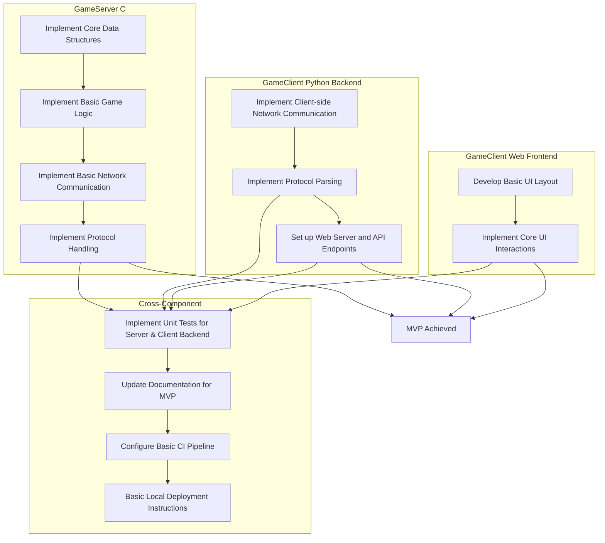

# Exploding Kittens MVP Release Plan

This document outlines the prioritized tasks required to achieve a Minimum Viable Product (MVP) for the Exploding Kittens project's first public release. The MVP focuses on core gameplay mechanics and essential user interaction.

## 1. GameServer (C) Core Logic & Networking

### Task 1.1: Implement Core Game Data Structures
- **Estimated Time**: 1-2 days
- **Complexity**: Medium
- **Description**: Define C structs for `Player`, `Card`, `Deck`, `GameState`, and `Action`. This forms the foundation for all game logic.
    - **Key Steps**:
        - Define `Card` enum/struct with types (Exploding Kitten, Defuse, Attack, Skip, See the Future, Shuffle, Nope, Cat cards).
        - Define `Player` struct (ID, name, hand, status).
        - Define `Deck` struct (cards, size).
        - Define `GameState` struct (players, deck, discard pile, current player, turn direction).
    - **Expected Outcome**: Well-defined and organized data structures in `server/src/game/include/game.h` and `server/src/game/src/game.c`.

### Task 1.2: Implement Basic Game Logic
- **Estimated Time**: 2-3 days
- **Complexity**: High
- **Description**: Implement fundamental game mechanics such as deck initialization, shuffling, dealing initial hands, drawing cards, and basic turn progression.
    - **Key Steps**:
        - `init_game_state()`: Initialize deck, shuffle, deal cards to players.
        - `draw_card()`: Function to draw a card from the deck.
        - `handle_exploding_kitten()`: Logic for defusing or exploding.
        - `next_turn()`: Advance to the next player's turn.
    - **Expected Outcome**: Functional core game loop logic within `server/src/game/src/game.c`.

### Task 1.3: Implement Basic Network Communication (Server-side)
- **Estimated Time**: 2-3 days
- **Complexity**: Medium
- **Description**: Set up the C server to listen for incoming connections, accept multiple clients, and send/receive binary messages based on the defined protocol.
    - **Key Steps**:
        - `setup_server_socket()`: Initialize TCP socket, bind, listen.
        - `accept_client_connection()`: Handle new client connections.
        - Implement functions to send and receive `Message Type` and `Payload Length` from the `COMMUNICATION_PROTOCOL.md`.
        - Basic client management (add/remove players).
    - **Expected Outcome**: A running C server that can accept multiple client connections and exchange raw binary data.

### Task 1.4: Implement Protocol Handling (Server-side)
- **Estimated Time**: 2-3 days
- **Complexity**: High
- **Description**: Implement the server-side logic to parse incoming client messages (`JOIN_GAME`, `DRAW_CARD_REQUEST`, `PLAY_CARD_REQUEST`) and construct outgoing server messages (`GAME_STATE_UPDATE`, `PLAYER_HAND_UPDATE`).
    - **Key Steps**:
        - Parse `JOIN_GAME` requests, add new players to game state.
        - Process `DRAW_CARD_REQUEST`, trigger `draw_card()` logic.
        - Process `PLAY_CARD_REQUEST`, trigger `play_card()` logic for basic cards (Skip, Attack, Nope, See the Future, Shuffle).
        - Construct and send `GAME_STATE_UPDATE` to all clients after significant game state changes.
        - Construct and send `PLAYER_HAND_UPDATE` to individual clients when their hand changes.
        - Implement basic error code responses (`0xF0`, `0xF1`, `0xF2`, `0xF3`, `0xF4`).
    - **Expected Outcome**: Server can correctly interpret client actions and send relevant game state updates.

## 2. GameClient (Python Backend)

### Task 2.1: Implement Client-side Network Communication
- **Estimated Time**: 1-2 days
- **Complexity**: Medium
- **Description**: Develop the Python backend to connect to the C `GameServer` and handle sending/receiving binary messages.
    - **Key Steps**:
        - Establish TCP connection to the C server.
        - Implement functions to send and receive binary data according to the protocol.
        - Handle connection errors and disconnections.
    - **Expected Outcome**: Python backend can reliably connect to and communicate with the C server.

### Task 2.2: Implement Protocol Parsing (Client-side)
- **Estimated Time**: 1-2 days
- **Complexity**: Medium
- **Description**: Implement logic in Python to construct client messages (`JOIN_GAME`, `DRAW_CARD_REQUEST`, `PLAY_CARD_REQUEST`) and parse incoming server messages (`GAME_STATE_UPDATE`, `PLAYER_HAND_UPDATE`).
    - **Key Steps**:
        - Serialize Python data into binary format for outgoing messages.
        - Deserialize incoming binary messages into Python data structures.
        - Update client-side game state based on `GAME_STATE_UPDATE` and `PLAYER_HAND_UPDATE`.
    - **Expected Outcome**: `client/backend/src/protocol.py` can correctly encode/decode messages.

### Task 2.3: Set up Web Server and API Endpoints
- **Estimated Time**: 1-2 days
- **Complexity**: Low
- **Description**: Configure a lightweight Python web server (e.g., Flask) to serve the frontend and expose initial API endpoints for game interaction.
    - **Key Steps**:
        - Initialize Flask/FastAPI app in `client/backend/app.py`.
        - Implement `GET /` to serve `index.html`.
        - Implement `GET /<path:filename>` to serve static assets (CSS, JS).
        - Implement `GET /api/connect_server` to initiate connection to C server.
        - Implement `POST /api/draw_card` to send `DRAW_CARD_REQUEST` to C server.
        - Implement `POST /api/play_card` to send `PLAY_CARD_REQUEST` to C server.
        - Implement `GET /api/game_state` and `GET /api/player_hand` to expose client-side game state to the frontend.
    - **Expected Outcome**: Python backend serves the web frontend and provides basic API for game actions.

## 3. GameClient (Web Frontend)

### Task 3.1: Develop Basic UI Layout
- **Estimated Time**: 1-2 days
- **Complexity**: Low
- **Description**: Create the initial HTML structure and basic CSS styling for the game interface.
    - **Key Steps**:
        - `client/frontend/public/index.html`: Main game area, player hand display, deck/discard pile placeholders.
        - `client/frontend/public/style.css`: Basic styling for layout and elements.
    - **Expected Outcome**: A visually structured, albeit unstyled, game interface in the browser.

### Task 3.2: Implement Core UI Interactions
- **Estimated Time**: 2-3 days
- **Complexity**: Medium
- **Description**: Enable players to see their hand, draw cards, and play cards through the web interface.
    - **Key Steps**:
        - `client/frontend/public/index.js`:
            - Fetch player hand and game state from Python backend API.
            - Dynamically render player's hand (card images/names).
            - Implement "Draw Card" button that calls `/api/draw_card`.
            - Implement "Play Card" functionality for cards in hand, calling `/api/play_card`.
            - Display basic game state (e.g., cards in deck, current player).
            - Implement a mechanism for real-time updates from the backend (e.g., polling `/api/game_state` and `/api/player_hand` at intervals).
    - **Expected Outcome**: Players can interact with the game through the web UI, performing basic actions.

## 4. Testing & Documentation

### Task 4.1: Implement Unit Tests for Server & Client Backend
- **Estimated Time**: 2-3 days
- **Complexity**: Medium
- **Description**: Write unit tests for critical components of the C GameServer and Python GameClient backend to ensure correctness of logic and protocol handling.
    - **Key Steps**:
        - C Server: Add tests for card shuffling, dealing, `draw_card`, `handle_exploding_kitten` in `server/tests/test_game.c`.
        - Python Client Backend: Add tests for protocol serialization/deserialization, and basic API endpoint responses in `client/tests/test_backend.py`.
    - **Expected Outcome**: Automated unit tests provide confidence in core logic.

### Task 4.2: Update Documentation for MVP
- **Estimated Time**: 1 day
- **Complexity**: Low
- **Description**: Ensure `README.md`, `API_SPEC.md`, and `COMMUNICATION_PROTOCOL.md` accurately reflect the MVP functionality and setup.
    - **Key Steps**:
        - `README.md`: Verify setup and running instructions are clear and up-to-date for the MVP.
        - `docs/API_SPEC.md`: Confirm all implemented API endpoints are documented.
        - `docs/COMMUNICATION_PROTOCOL.md`: Ensure all implemented message types and their structures are accurate.
    - **Expected Outcome**: Clear and accurate documentation for users and future developers.

## 5. CI/CD & Deployment

### Task 5.1: Configure Basic CI Pipeline
- **Estimated Time**: 1-2 days
- **Complexity**: Medium
- **Description**: Set up GitHub Actions to automatically build and run unit tests for both the C server and Python client on every push/pull request to `main`.
    - **Key Steps**:
        - `.github/workflows/ci.yml`:
            - Job for C server: checkout, setup C environment, build, run C tests.
            - Job for Python client: checkout, setup Python environment, install dependencies, run Python tests.
    - **Expected Outcome**: Automated checks ensure code quality and prevent regressions.

### Task 5.2: Basic Local Deployment Instructions
- **Estimated Time**: 0.5 days
- **Complexity**: Low
- **Description**: Provide clear instructions in `README.md` on how to run the C server and Python client locally for testing and demonstration.
    - **Key Steps**:
        - Detail steps to compile C server.
        - Detail steps to set up Python virtual environment and install dependencies.
        - Provide commands to start both the C server and Python backend.
        - Instruct on how to access the web frontend in a browser.
    - **Expected Outcome**: Anyone can easily set up and run the MVP locally.

## MVP Development Flow

